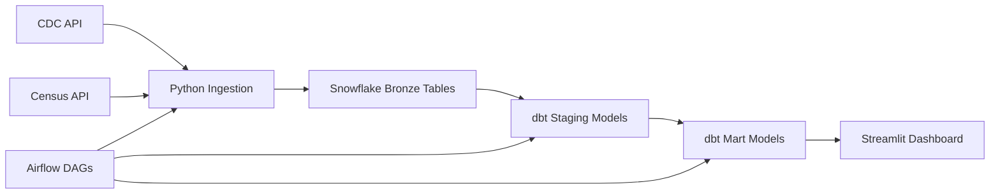

# COVID Project 3 — Presentation Guide

## 1) Presentation theme
**Title:** _COVID Outcomes Observatory: An End-to-End Data Engineering Pipeline_

**One-line pitch:**
We built a full data platform that ingests COVID case data from the CDC and population data from the U.S. Census, transforms it in Snowflake with dbt, orchestrates it with Airflow, and presents insights in a Streamlit dashboard.

---

## 2) Suggested 8-slide deck (5–7 minutes)

### Slide 1 — Title
**Title:** COVID Outcomes Observatory  
**Subtitle:** Airflow + Snowflake + dbt + Streamlit

**Say:**
- This project demonstrates an end-to-end modern data engineering workflow.
- Our goal was to turn public COVID data into a reliable analytics pipeline and dashboard.

### Slide 2 — Problem & Goal
**Title:** Why this project matters

**Bullets:**
- COVID data is large, frequently updated, and hard to analyze manually.
- Public health trends are more useful when paired with population context.
- We wanted a repeatable pipeline, not just a one-time notebook analysis.

**Say:**
- The main goal was to automate ingestion, transformation, and reporting.
- We focused on making the workflow reproducible and presentation-ready.

### Slide 3 — Data Sources
**Title:** Source data we used

**Bullets:**
- **CDC COVID case data** for case-level and severity information
- **U.S. Census data** for county/state population and FIPS mapping
- Combined sources enable both raw totals and population-normalized metrics

**Say:**
- CDC gives us outcomes like cases, hospitalization status, and death status.
- Census adds population context so we can compare regions more fairly.

### Slide 4 — Architecture
**Title:** Pipeline architecture

**Key components:**
- **Python ingestion** with `httpx`, `requests`, and `polars`
- **Snowflake** as the warehouse
- **dbt** for staging and marts
- **Airflow** for orchestration
- **Streamlit** for analytics and visualization
- **Docker** for local reproducibility

### Slide 5 — Orchestration & Modeling
**Title:** How the pipeline works

**Bullets:**
- Separate Airflow DAGs handle **CDC ingestion** and **Census ingestion**
- A **master DAG** waits for ingestion and transformation dependencies
- dbt builds analytics-ready models including:
  - `fct_deaths_per_cases`
  - `fct_covid_by_fips`

**Say:**
- The CDC pipeline runs daily, while the Census pipeline runs weekly.
- The master orchestration DAG keeps the workflow modular and reliable.

### Slide 6 — Dashboard & Insights
**Title:** What the app shows

**Bullets:**
- **Overview tab:** state-level severity KPIs
- **Trends tab:** monthly movement and rolling averages
- **Demographics tab:** age and gender breakdowns
- **Geography tab:** state map for cases and severity metrics
- **Pipeline tab:** operational freshness and row-count checks

**Say:**
- The dashboard is designed for both analysis and operational visibility.
- It supports filters by state, case count threshold, trend focus, and map metric.

### Slide 7 — Challenges & What We Learned
**Title:** Key engineering lessons

**Bullets:**
- Integrating multiple public datasets with different grains and schemas
- Building dependable orchestration across ingestion and transformation layers
- Turning raw case data into business-friendly metrics and visualizations
- Designing a pipeline that is easy to rerun, monitor, and demo

**Say:**
- The biggest lesson was that good data engineering is not just about loading data.
- It is also about data quality, orchestration, and making outputs usable.

### Slide 8 — Impact & Next Steps
**Title:** Future improvements

**Bullets:**
- Add more quality tests and freshness alerts
- Expand county-level geographic visualization
- Add forecasting or anomaly detection
- Improve documentation and deployment automation

**Closing line:**
This project shows how modern data tools can turn public data into a usable analytics product.

---

## 3) Short speaker script (about 60–90 seconds)

> We built an end-to-end COVID analytics pipeline using public CDC and Census data. The pipeline ingests raw data with Python, stores it in Snowflake, transforms it with dbt, schedules it with Airflow, and presents the results in a Streamlit dashboard. This lets us move from raw public datasets to reliable, interactive insights on cases, deaths, hospitalizations, and geographic patterns. The project highlights not just data analysis, but also orchestration, modeling, and production-style workflow design.

---

## 4) Demo plan (best for live presentation)

### Recommended demo order
1. Show the **Airflow DAGs** briefly
2. Open the **Streamlit app**
3. Walk through:
   - Overview KPIs
   - Trends tab
   - Demographics tab
   - Geography tab
   - Pipeline status tab
4. End by restating the business value

### Demo narration
- “Here is the orchestration layer.”
- “Here is the transformed output exposed through the dashboard.”
- “This filter lets us compare states and severity metrics quickly.”
- “This is where the project becomes useful to a decision-maker.”

---

## 5) Likely questions and strong answers

### Q: Why did you use both CDC and Census data?
**A:** CDC provides health outcomes, while Census provides population context. Combining them makes per-capita analysis possible.

### Q: Why use dbt instead of only Python SQL scripts?
**A:** dbt makes transformations modular, testable, and easier to manage in a warehouse-first workflow.

### Q: Why use Airflow?
**A:** Airflow schedules and coordinates ingestion and transformation dependencies so the pipeline can run automatically and reliably.

### Q: What makes this a data engineering project instead of only a dashboard?
**A:** The dashboard is only the final layer. The main work is the automated ingestion, warehousing, transformation, orchestration, and operational monitoring.

---

## 6) Final slide takeaway

**Takeaway sentence:**
We built a complete analytics pipeline that turns public COVID and Census data into automated, trustworthy, and interactive decision-support insights.
